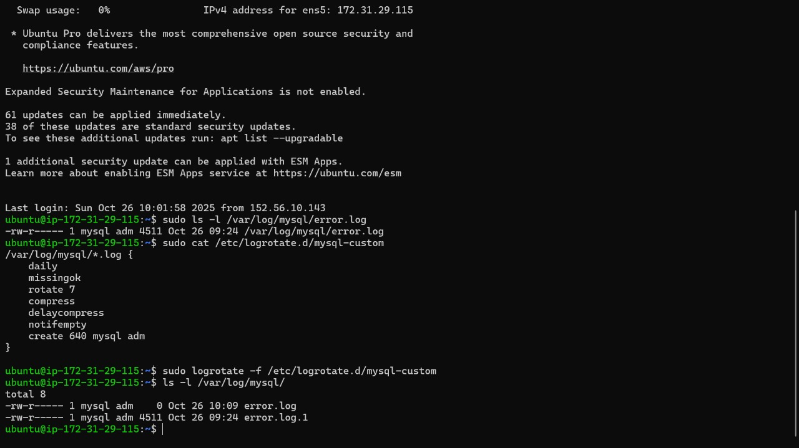
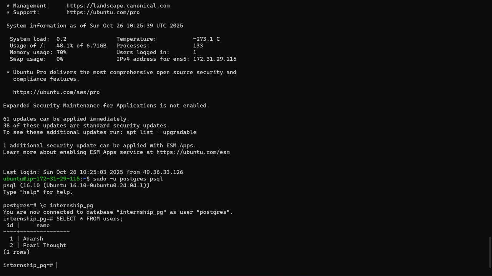
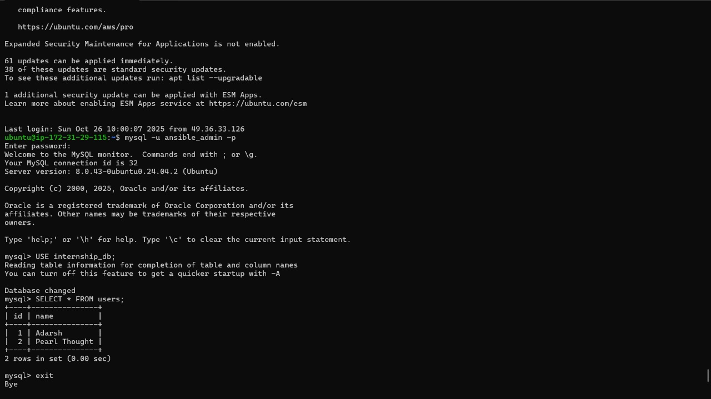
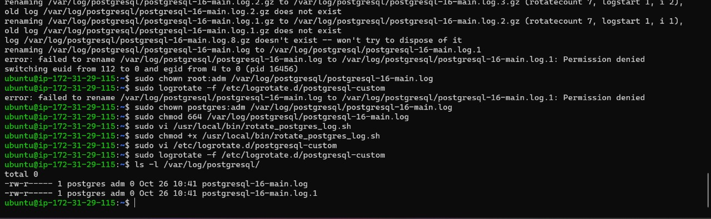

# Internship Task: Multi-Service Deployment with Ansible

## 🧩 Objective

Deploy and configure the following services on a remote Ubuntu VM using Ansible:
- Nginx
- MySQL
- PostgreSQL
- Docker Swarm

Additionally:
- Create users and seed sample data in MySQL and PostgreSQL via Ansible
- Identify log file locations for both databases
- Configure and test log rotation
- Capture screenshots and push all code to GitHub

---

## 📁 Repository Structure

```
Task-P/
├── host.ini                   # Inventory file for Ansible
├── nginx.yml                  # Playbook to install and configure Nginx
├── mysql.yml                  # Playbook to install MySQL, create user, seed data
├── postgresql.yml             # Playbook to install PostgreSQL, create user, seed data
├── docker-swarm.yml           # Playbook to initialize Docker Swarm
├── rotate_postgres_log.sh     # Wrapper script to rotate PostgreSQL logs safely
```

---

## ⚙️ Playbook Details

### 1. `nginx.yml`
- Installs Nginx
- Ensures service is running and enabled

### 2. `mysql.yml`
- Installs MySQL
- Creates `intern_user` and `internship_db`
- Seeds sample data into a `users` table
- Log file: `/var/log/mysql/error.log`

### 3. `postgresql.yml`
- Installs PostgreSQL
- Creates `intern_user` and `internship_pg`
- Seeds sample data into a `users` table
- Log file: `/var/log/postgresql/postgresql-16-main.log`

### 4. `docker-swarm.yml`
- Installs Docker
- Initializes Docker Swarm on the remote VM

---

## 🔁 Log Rotation

### ✅ MySQL
- Config file: `/etc/logrotate.d/mysql-custom`
```conf
/var/log/mysql/*.log {
    daily
    missingok
    rotate 7
    compress
    delaycompress
    notifempty
    create 640 mysql adm
}
```

### ✅ PostgreSQL
- Config file: `/etc/logrotate.d/postgresql-custom`
- Uses wrapper script due to permission issues:
```conf
/var/log/postgresql/*.log {
    daily
    missingok
    rotate 7
    compress
    delaycompress
    notifempty
    create 640 postgres adm
    su root adm
    prerotate
        /usr/local/bin/rotate_postgres_log.sh
    endscript
}
```

### Wrapper Script: `rotate_postgres_log.sh`
```bash
#!/bin/bash
LOGFILE="/var/log/postgresql/postgresql-16-main.log"
ROTATED="/var/log/postgresql/postgresql-16-main.log.1"

mv "$LOGFILE" "$ROTATED"
touch "$LOGFILE"
chown postgres:adm "$LOGFILE"
chmod 640 "$LOGFILE"
```

---
### 🖼️ Screenshot 1: MySQL Verification


### 🖼️ Screenshot 2: PostgreSQL Verification


### 🖼️ Screenshot 3: Logrotate Configs


### 🖼️ Screenshot 4: Playbooks View



---

## ✅ Submission Instructions

- Push this folder to your GitHub repo
- Include all screenshots and this README
- Post in the internship channel tagging **SenG** and **Abhineet**
- Mention:
  - All services deployed via Ansible
  - DBs seeded and verified
  - Logs identified and rotated
  - GitHub repo link

---

## 🧠 What Is Log Rotation?

> Log rotation is the process of archiving and replacing log files to prevent them from growing indefinitely. It helps maintain system performance and disk hygiene.

You configured it using:
- `logrotate` utility
- Custom rules (`daily`, `rotate 7`, `compress`)
- `su` directive and a wrapper script for PostgreSQL

---

## 🙌 Outcome

This task demonstrates:
- Multi-service orchestration via Ansible
- Real-world troubleshooting and permission handling
- Observability and log hygiene
- Reproducible automation across services

